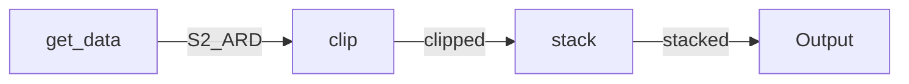

# Workflows

## Acronyms
* ARD - Analysis Ready Data (a pre-processed dataset)
* AWS - Amazon Web Services
* CEDA - Centre for Environmental Data Analysis 
* CWL - Common Workflow Language (a specification for standardising workflows) 
* EO - Earth observation
* NDVI - Normalised Difference Vegetation Index (a simple and polular indicator of vegetation amount and vigour)
* YAML - Yet Another Markup Language (or YAML ain't markup language)

## Context
The first thing to do when designing a workflow for inclusion as an EO Application Package on the Eo Data Hub is understand the context of what is desired, and how that may need to be referred to in the Workflow. For this example Workflow, we will take a list of Sentinel-2 ARD images, clip them to an area of interest, and stack . The flow will look like the following:



The next thing to do is access the data to be used in the Workflow. In this case we will download two bands of a Sentinel 2 image held on AWS. We will use the [curl](https://curl.se/) tool to do this, saving the accessed image as `B0$.tif` (where $ is the band number):

``` 
curl -o B04.tif https://sentinel-cogs.s3.us-west-2.amazonaws.com/sentinel-s2-l2a-cogs/53/H/PA/2021/7/S2B_53HPA_20210723_0_L2A/B04.tif

curl -o B03.tif https://sentinel-cogs.s3.us-west-2.amazonaws.com/sentinel-s2-l2a-cogs/53/H/PA/2021/7/S2B_53HPA_20210723_0_L2A/B03.tif 
```

The commands that we will use in the Workflow are all available through [gdal](https://gdal.org/index.html).  

### Clip the image
We will use `gdal_-_translate` to clip the larger image to a smaller more manageable dataset. The gdal command that we can test and that we will need to replicate in CWL is: 

`gdal_translate -projwin ULX ULY LRX LRY  -projwin_srs EPSG:4326 BO4.tif B04_clipped.tif`

where the coordinates UL refer to upper left and LR to lower right X and Y.

### Stack the clips
Similarly, we will use `gdal_merge.py` to construct the stacked images from the clipped image. This can be tested using the following command:

`gdal_merge.py -separate B04_clipped.tif B03_clipped.tif -o stacked.tif` 

## Building the Workflow
### Required files
There are three main files that are required to construct a CWL Workflow. These are:
* DockerFile or existing online container
* CWL file
* YAML file
It may be that other files e.g. a .sh script or a Python script are also needed, depending on how bespoke and/or complex the desired Workflow is. 

### cwltool
To run CWL workflows you will need a CWL runner. The most commonly used (locally) is `cwltool` which is a Python project maintained by the CWL community. It will support everything in the current CWL specification. `cwltool` can be installed using `pip` or variants of `conda`. More information can be found [here](https://www.commonwl.org/user_guide/introduction/prerequisites.html) and [here](https://cwl-for-eo.github.io/guide/requirements/). 

### Containers
For the purposes of this example, we will be pulling the GDAL container from the OSgeo repository (see [here](https://github.com/OSGeo/gdal/tree/master/docker)).

**NOTE**: There are a number of different images that can be accessed. To use the .py tools available through GDAL then 'GDAL Python' is required.

 If we wanted to we could also build our own bespoke image using a DockerFile and then run that. This is often used when data processing scripts need to be copied into the container.

We will also be using [Podman](https://podman.io/) as our container software. 'podman' is a drop in replacement for Docker but does require the `--podman` arguement in the `cwltool` command. If using Windws, or if you are more familiar with Docker, then using Docker is the default containerisation method.

### CWL files
For this example we require a CWL CommandLine file for both the clipping and stacking components of the workflow. We will also need a CWL Workflow file to bring these together and run the entire process. The next block of code outlines the overall Workflow file.
**Note**: This example is based on the example found [here](https://cwl-for-eo.github.io/guide/101/cwl-101/tutorial-2/workflow/). Some errors were found in the original CWL files and the version presneted here hasbeen tested and is known to work on a local Linux system. 

```
class: Workflow
label: Sentinel-2 clipping and stacking
doc:  This workflow creates a stacked composite. File name: composite.cwl
id: main

requirements:
- class: ScatterFeatureRequirement

inputs:

  geotiff:
    doc: list of geotifs
    type: File[]

  bbox: 
    doc: area of interest as a bounding box
    type: string

  epsg:
    doc: EPSG code 
    type: string
    default: "EPSG:4326"

outputs:
  rgb:
    outputSource:
    - node_concatenate/composite
    type: File

steps:

  node_translate:

    run: gdal-translate.cwl

    in:

      geotiff: geotiff  
      bbox: bbox
      epsg: epsg

    out:
    - clipped_tif

    scatter: geotiff
    scatterMethod: dotproduct

  node_concatenate:

    run: concatenate2.cwl

    in: 
      tifs:
        source: node_translate/clipped_tif

    out:
    - composite


cwlVersion: v1.0

```
From this example, we can see that we require two CommandLine CWL files: `gdal-translate.cwl`  and `concatenate2.cwl`. Let's deal with these in order.

```
class: CommandLineTool

cwlVersion: v1.0
doc:  This runs GDAL Translate to clip an image to bbox corner coordinates.

requirements: 
  InlineJavascriptRequirement: {}
  DockerRequirement: 
    dockerPull: ghcr.io/osgeo/gdal:ubuntu-small-latest

baseCommand: gdal_translate

arguments:
- -projwin 
- valueFrom: ${ return inputs.bbox.split(",")[0]; }
- valueFrom: ${ return inputs.bbox.split(",")[3]; }
- valueFrom: ${ return inputs.bbox.split(",")[2]; }
- valueFrom: ${ return inputs.bbox.split(",")[1]; }
- valueFrom: ${ return inputs.geotiff.basename.replace(".tif", "") + "_clipped.tif"; }
  position: 8

inputs:
  geotiff: 
    type: File
    inputBinding:
      position: 7
  bbox: 
    type: string
  epsg:
    type: string
    default: "EPSG:4326" 
    inputBinding:
      position: 6
      prefix: -projwin_srs
      separate: true

outputs:
  clipped_tif:
    outputBinding:
      glob: '*_clipped.tif'
    type: File


```

```
class: CommandLineTool

cwlVersion: v1.0
doc: This runs GDAL Merge to stack images together.

requirements:
  InlineJavascriptRequirement: {}
  DockerRequirement: 
    dockerPull: ghcr.io/osgeo/gdal:ubuntu-small-latest

baseCommand: gdal_merge.py

arguments: 
- -separate 
- valueFrom: ${ return inputs.tifs; }
- -o
- composite.tif
# gdal_merge.py -separate 1.tif 2.tif 3.tif -o rgb.tif

inputs:

  tifs:
    type: File[]

outputs:

  composite:
    outputBinding:
      glob: '*.tif'
    type: File

```
**NOTE**: YAML generally doesn't play well with tabs as whitespace so it's best practice to use spaces for indentations

## Running the Workflow
Now that we have our commandline CWL component files, and the Workflow CWL file that brings the tools together, we need to specify the input parameters. This is done using a `parameters.yml` file, where the name of the file can be anything that you want. The contents should follow the layout that we will be using:

```
bbox: "136.659,-35.96,136.923,-35.791"
geotiff: 
- { "class": "File", "path": "../B04.tif" }
- { "class": "File", "path": "../B03.tif" }
epsg: "EPSG:4326"
```
You will need to change the `path` parameter to match the location of your input files. 

Now we run it with the command:

`cwltool --podman composite.cwl composite-params.yml`

**Note**: remember that if you are using Docker then you do not need the `--podman` arguement.

## Outputs
This workflow takes a couple of minutes to run, during which time the executed commandsand their runtime messages are displayed on the commandline. Once the workflow completes, the output file will be found in the directory from where the workflow was run. Intermediate files that are not specified in the out block in the workflow are automatically deleted.

The output .tif file can now be opened in QGIS or a similar software application to check that the output is as expected (in this case a 2-layer image of a clipped area of the extent of the input files).

## Tips
You can pass `--leave-tmpdirs` to the `cwltool` command. This is often helpful to figure out if the outputs from a step are what you think they should be.