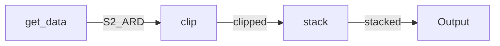
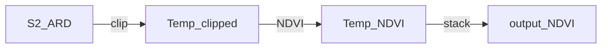

# Workflows

## Acronyms
* ARD - Analysis Ready Data (a pre-processed dataset)
* CEDA - Centre for Environmental Data Analysis 
* CWL - Common Workflow Language (a specification for standardising workflows) 
* EO - Earth observation
* NDVI - Normalised Difference Vegetation Index (a simple and polular indicator of vegetation amount and vigour)
* YAML - Yet Another Markup Language (or YAML ain't markup language)

## Context
The first thing to do when designing a workflow for inclusion as an EO Application Package on the Eo Data Hub is understand the context of what is desired, and how that may need to be referred to in the Workflow. For this example Workflow, we will take a list of Sentinel-2 ARD images, clip them to an area of interest, and stack . The flow will look like the following:



The next thing to do is access the data to be used in the Workflow. In this case we will download one of the CEDA Sentinel-2 ARD files over Eastbourne on the south coast of England. We will use the [curl](https://curl.se/) tool to do this, saving the accessed image as `sat.tif`:

`curl https://dap.ceda.ac.uk/neodc/sentinel_ard/data/sentinel_2/2023/11/19/S2B_20231119_latn509lone0006_T30UYB_ORB094_20231119115015_utm30n_osgb_vmsk_sharp_rad_srefdem_stdsref.tif --output sat.tif`

The commands that we will use in the Workflow are all available through [gdal](https://gdal.org/index.html).  

### Clip the image
We will use `gdalwarp` to clip the larger image to a smaller more manageable dataset. The gdal command that we can test and that we will need to replicate in CWL is: 

`gdalwarp -cutline path/to/polygonfile.shp -crop_to_cutline sat.tif output.tif`

### Calculate the index
Similarly, we will use `gdal_calc.py` to construct the NDVI dataset from the clipped image. this can be tested using the following command:

`gdal_calc.py -A output.tif --A_band=1 -B output.tif --B_band=2 --type=Float32 --outfile=ndvi.tif --calc="((B-A)/(B+A))"` 

## Building the Workflow
### Required files
There are three main files that are required to construct a CWL Workflow. These are:
* DockerFile or existing online container
* CWL file
* YAML file
It may be that other files e.g. a .sh script or a Python script are also needed, depending on how bespoke and/or complex the desired Workflow is. 

### Containers
For the purposes of this example, we will be pulling the GDAL container from the OSgeo repository (see [here](https://github.com/OSGeo/gdal/pkgs/container/gdal)).

NOTE https://github.com/OSGeo/gdal/tree/master/docker

 If we wanted to we could also build our own bespoke image using a DockerFile and then run that. This is often used when data processing scripts need to be copied into the container.
We will also be using [Podman](https://podman.io/) as our container software. podman is a drop in replacement for Docker but does require the `--podman` arguement in the `cwltool` command. 
### CWL files
For this example we require a CWL CommandLine file for both the clipping and NDVI calulation components of the workflow. We will also need a CWL Workflow file to run the entire process. The next block of code outlines the Workflow file. 

```
class: Workflow
label: Sentinel-2 clipping and stacking
doc:  This workflow creates an RGB composite
id: main

requirements:
- class: ScatterFeatureRequirement

inputs:

  geotiff:
    doc: list of geotifs
    type: File[]

  bbox: 
    doc: area of interest as a bounding box
    type: string

  epsg:
    doc: EPSG code 
    type: string
    default: "EPSG:4326"

outputs:
  rgb:
    outputSource:
    - node_concatenate/composite
    type: File

steps:

  node_translate:

    run: gdal-translate.cwl

    in:

      geotiff: geotiff  
      bbox: bbox
      epsg: epsg

    out:
    - clipped_tif

    scatter: geotiff
    scatterMethod: dotproduct

  node_concatenate:

    run: concatenate2.cwl

    in: 
      tifs:
        source: node_translate/clipped_tif

    out:
    - composite


cwlVersion: v1.0

```
From this example, we can see that we require two CommandLine CWL files: `clip.cwl`  and `calcs.cwl`. Let's deal with these in order.

```
class: CommandLineTool

cwlVersion: v1.0
doc:  This runs GDAL Translate to clip an image to bbox corner coordinates.

requirements: 
  InlineJavascriptRequirement: {}
  DockerRequirement: 
    dockerPull: ghcr.io/osgeo/gdal:ubuntu-small-latest

baseCommand: gdal_translate

arguments:
- -projwin 
- valueFrom: ${ return inputs.bbox.split(",")[0]; }
- valueFrom: ${ return inputs.bbox.split(",")[3]; }
- valueFrom: ${ return inputs.bbox.split(",")[2]; }
- valueFrom: ${ return inputs.bbox.split(",")[1]; }
- valueFrom: ${ return inputs.geotiff.basename.replace(".tif", "") + "_clipped.tif"; }
  position: 8

inputs:
  geotiff: 
    type: File
    inputBinding:
      position: 7
  bbox: 
    type: string
  epsg:
    type: string
    default: "EPSG:4326" 
    inputBinding:
      position: 6
      prefix: -projwin_srs
      separate: true

outputs:
  clipped_tif:
    outputBinding:
      glob: '*_clipped.tif'
    type: File


```

```
class: CommandLineTool

cwlVersion: v1.0
doc: This runs GDAL Merge to stack images together.

requirements:
  InlineJavascriptRequirement: {}
  DockerRequirement: 
    dockerPull: ghcr.io/osgeo/gdal:ubuntu-small-latest

baseCommand: gdal_merge.py

arguments: 
- -separate 
- valueFrom: ${ return inputs.tifs; }
- -o
- composite.tif
# gdal_merge.py -separate 1.tif 2.tif 3.tif -o rgb.tif

inputs:

  tifs:
    type: File[]

outputs:

  composite:
    outputBinding:
      glob: '*.tif'
    type: File

```
**NOTE**: YAML generally doesn't play well with tabs as whitespace so make sure you use spaces for indentations

## Running the Workflow
Now that we have our tooling CWL files, and the Workflow CWL file that brings the tools together, we need to specify the input parameters. This is done using a `parameters.yml` file, where the name of the file can be anything that you want. The contents should follow the layout that we will be using:

```
infile:
  class: File
  path: test/chr22.truncated.nosamples.1kg.vcf.gz
genome: hg19
```
Remember infile matches the reference in the in block in our snpeff-workflow.cwl file.

Now we run it with the command:

`cwltool workflow.cwl parameters.yml`


## Outputs
It will take a minute to run, during which time we’ll see the commands that are executed and finally some JSON showing the output files. After it completes, we’ll find these new files in our directory – output.vcf, snpEff_summary.html, and snpEff_genes.txt. Notice, that we don’t find the intermediate unzipped.vcf file. Intermediate files that are not specified in the out block in the workflow are automatically deleted.

## Tips
You can pass --leave-tmpdirs to the cwltool command. This is often helpful to figure out if the outputs from a step are what you think they should be.


---
__TO DEAL WITH__

Stack the NDVIs

`gdal_merge.py -separate 1.tif 2.tif 3.tif -o rgb.tif`


> curl https://dap.ceda.ac.uk/neodc/sentinel_ard/data/sentinel_2/2023/11/19/S2B_20231119_latn509lone0009_T31UCS_ORB094_20231119115015_utm31n_osgb_vmsk_sharp_rad_srefdem_stdsref.tif --output sat2.tif`


