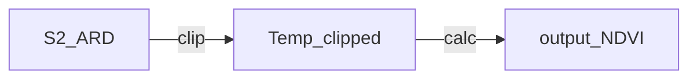
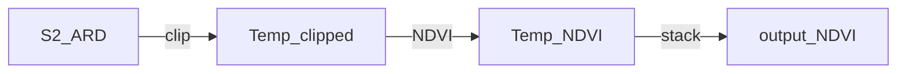

# Workflows

## Acronyms
* ARD - 
* CEDA -  
* CWL - 
* EO -
* NDVI - 

## Context
The first thing to do when designing a workflow for inclusion as an EO Application Package on the Eo Data Hub is understand the context of what is desired, and how that may need to be referred to in the Workflow. For this example Workflow, we will take a Sentinel-2 ARD image, clip it to an area of interest, calculate NDVI for that image. The flow will look like the following:

The next thing to do is access the data to be used in the Workflow. In this case we will download one of the CEDA Sentinel-2 ARD files over Eastbourne on the south coast of England. We will use the [curl](https://curl.se/) tool to do this, saving the accessed image as `sat.tif`:

`curl https://dap.ceda.ac.uk/neodc/sentinel_ard/data/sentinel_2/2023/11/19/S2B_20231119_latn509lone0006_T30UYB_ORB094_20231119115015_utm30n_osgb_vmsk_sharp_rad_srefdem_stdsref.tif --output sat.tif`

The commands that we will use in the Workflow are all available through [gdal](https://gdal.org/index.html).  

### Clip the image
We will use `gdalwarp` to clip the larger image to a smaller more manageable dataset. The gdal command that we can test and that we will need to replicate in CWL is: 

`gdalwarp -cutline path/to/polygonfile.shp -crop_to_cutline sat.tif output.tif`

### Calculate the index
Similarly, we will use `gdal_calc.py` to construct the NDVI dataset from the clipped image. this can be tested using the following command:

`gdal_calc.py -A output.tif --A_band=1 -B output.tif --B_band=2 --type=Float32 --outfile=ndvi.tif --calc="((B-A)/(B+A))"` 

.

.

---
__TO DEAL WITH__

Stack the NDVIs

`gdal_merge.py -separate 1.tif 2.tif 3.tif -o rgb.tif`

> curl https://dap.ceda.ac.uk/neodc/sentinel_ard/data/sentinel_2/2023/11/19/S2B_20231119_latn509lone0009_T31UCS_ORB094_20231119115015_utm31n_osgb_vmsk_sharp_rad_srefdem_stdsref.tif --output sat2.tif`

